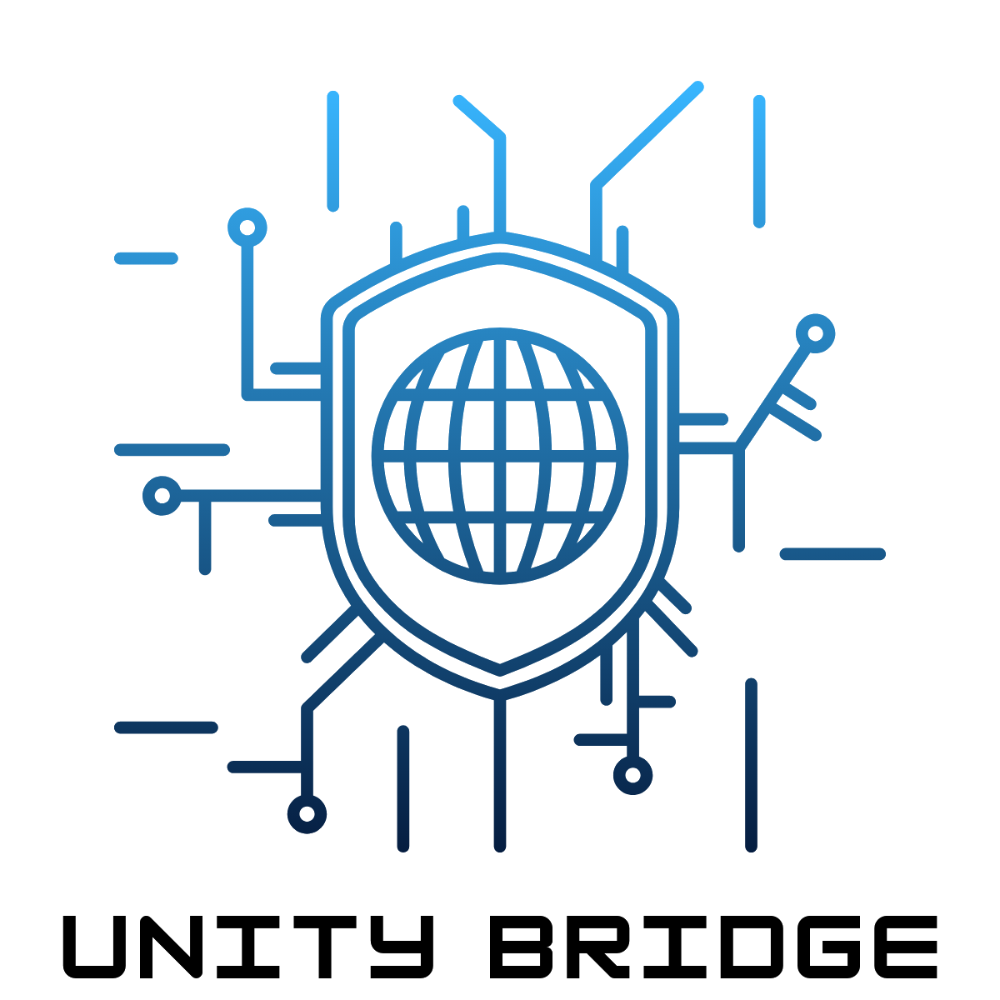

# Unity Bridge

> **Your bridge to secure connectivity** — affordable, enterprise-grade IT for small businesses and communities.



---

## 🔒 About

**Unity Bridge** is a security-first technology startup founded by a computer security and forensics specialist. We bridge the gap between cutting-edge cybersecurity and everyday business technology — delivering reliable IT infrastructure, custom software, and ready-made solutions at prices that make sense for small businesses.

Live site: www.unitybridge.dev

---

## ✨ What We Offer

| Service | Description |
|---|---|
| 🌐 **Networking & Infrastructure** | Fiber/wireless connectivity, network monitoring, server hardening, firewalls, VPNs |
| 💻 **Software Development** | Custom web & mobile apps, inventory systems, schedulers, learning portals |
| 📦 **Ready-Made Solutions** | LMS, business performance tracker, e-commerce kits, offline POS *(coming soon)* |

---

## 🛠️ Tech Stack

| Layer | Technology |
|---|---|
| Markup | HTML5 (semantic) |
| Styling | CSS3 — custom properties, Flexbox, Grid, animations |
| Fonts | [Syne](https://fonts.google.com/specimen/Syne) (display) + [DM Sans](https://fonts.google.com/specimen/DM+Sans) (body) |
| Icons | [Font Awesome 6](https://fontawesome.com/) |
| Scripts | Vanilla JavaScript (ES2020+) |
| Forms | [Formspree](https://formspree.io/) |

No frameworks. No build tools. Just clean, fast, dependency-light code.

---

## 📁 Project Structure

```
unity-bridge/
├── index.html          # Main page — all sections
├── css/
│   └── style.css       # All styles — tokens, layout, components, responsive
├── js/
│   └── main.js         # Interactions — cursor, particles, scroll reveal, form
├── images/
│   ├── logo.png        # Unity Bridge logo (transparent background)
│   └── favicon.png     # Browser tab icon
└── README.md
```

---

## 🚀 Running Locally

No build step required.

```bash
# Clone the repo
git clone https://github.com/systems-jackal/unity-bridge.git
cd unity-bridge

# Open directly in your browser
open index.html

# Or use a local server (recommended for form testing)
npx serve .
# then visit http://localhost:3000
```

---

## 🌐 Deployment

The site is deployed via **GitHub Pages** from the `main` branch root.

To deploy your own fork:
1. Go to your repo → **Settings** → **Pages**
2. Set source to `main` branch, `/ (root)` folder
3. Save — your site will be live at `https://<username>.github.io/unity-bridge/`

---

## 📬 Contact Form Setup

The contact form uses [Formspree](https://formspree.io/). To activate it:

1. Create a free account at [formspree.io](https://formspree.io/)
2. Create a new form and copy your form ID
3. In `index.html`, replace `yourformid` in the form action:

```html
<form action="https://formspree.io/f/YOUR_FORM_ID" method="POST">
```

---

## 👥 Team

| Name | Role | Specialties |
|---|---|---|
| **Dylan Kibet** | Founder & Lead Security Engineer | Server security, forensics, networking |
| **Bernard Korir** | Network Architect | ISP installation, routing, automation |
| **Ezra Tomno** | Software Developer | Full-stack, business apps, cloud |

---

## 📄 License

© 2025 Unity Bridge. All rights reserved.

Built with ❤️ in Kenya 🇰🇪